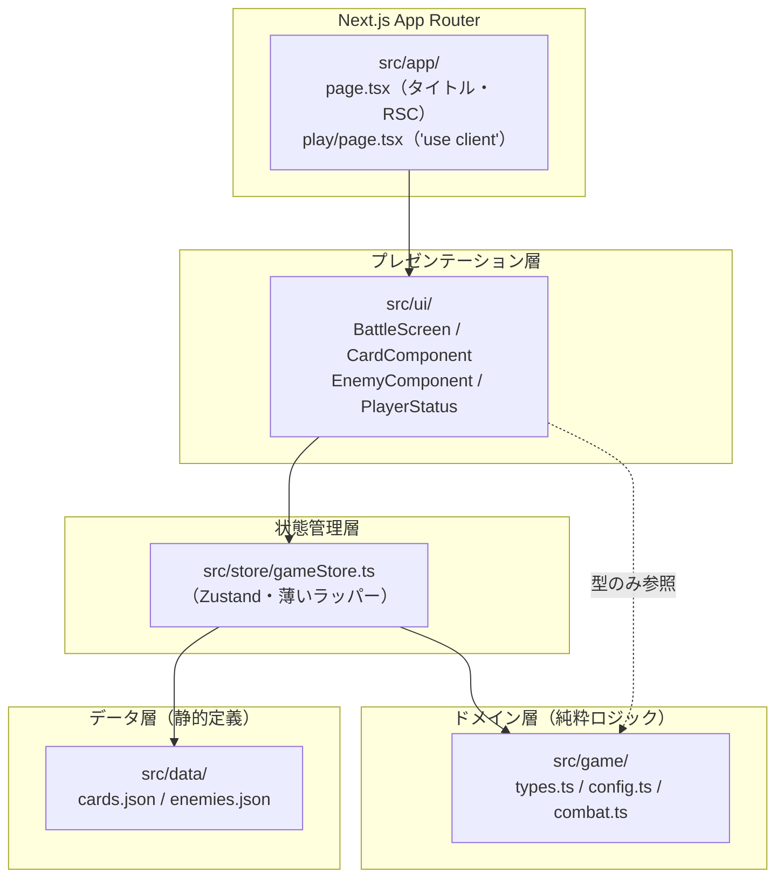
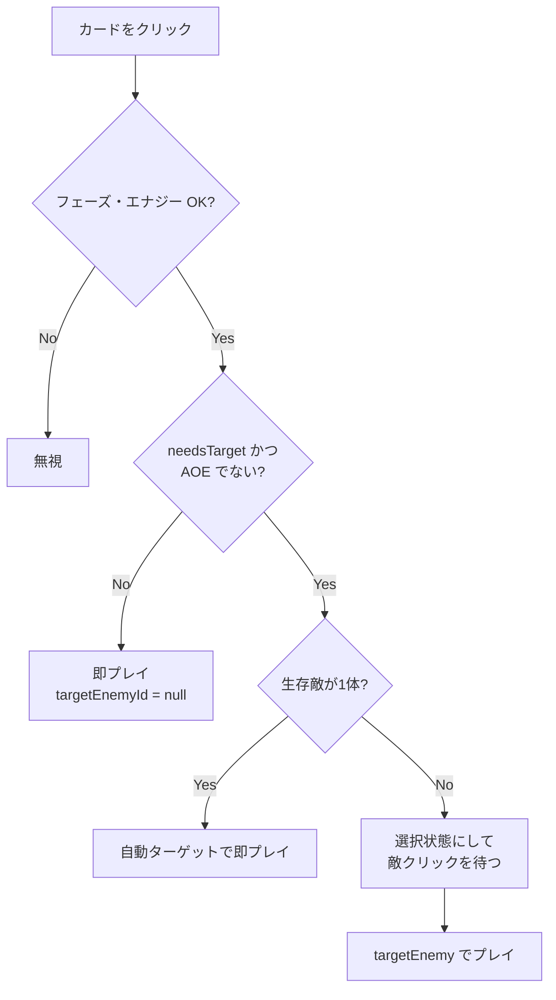
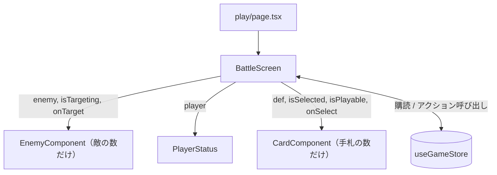
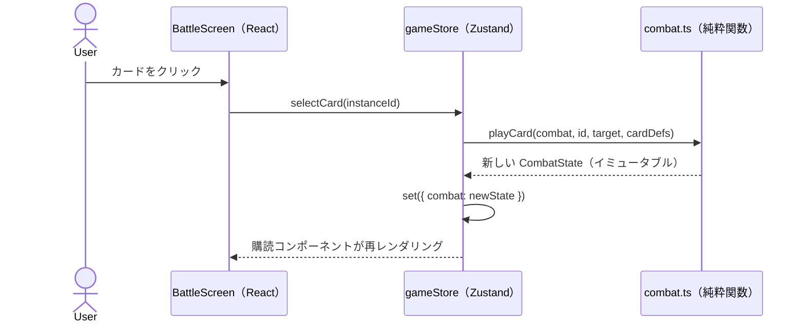
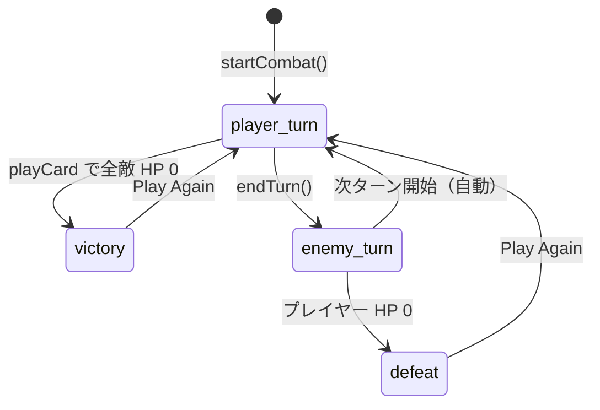

# Slay the Bearboy アーキテクチャドキュメント

> **最終更新: 2026-07-12**（この時点のコードの実態を記述。実装と乖離を見つけたら本資料を更新し、この日付を打ち直すこと）

技術者向けに、本プロジェクトの技術スタック・設計原則・モジュール構成・データフローをまとめた資料。
ゲームルールそのものは [game.md](./game.md)、企画背景は [slay-the-bearboy-proposal.md](./slay-the-bearboy-proposal.md) を参照。

> **数値の扱い**：ゲームバランスに関わる数値（HP・倍率・カード効果値など）は本資料には記載しない。
> [src/game/config.ts](../src/game/config.ts) の `GAME_CONFIG` と [src/data/](../src/data/) 配下の JSON を常に正とする。

---

## 1. 技術スタック

| 領域 | 技術 | 備考 |
|------|------|------|
| 言語 | TypeScript 5（`strict: true`） | プロジェクト全体で TypeScript のみを使用 |
| フレームワーク | Next.js 16.x（App Router / `src` 規約） | バージョンは [package.json](../package.json) を正とする |
| UI | React 19.x | 関数コンポーネントのみ |
| 状態管理 | Zustand 5.x | ストアは `src/store/gameStore.ts` の1つのみ |
| スタイル | Tailwind CSS 4（`@tailwindcss/postcss`） | CSS ファイルは `src/app/globals.css` のみ |
| Lint | ESLint 9 + `eslint-config-next` | `npm run lint` / `task lint` |
| ローカル開発 | Docker Compose（`node:24-alpine`） + Task | カスタムイメージなし・バインドマウント方式 |
| 本番ホスティング | Vercel | `git push` で自動デプロイ。Docker は本番に関与しない |
| バックエンド | **なし** | 完全クライアントサイド。API Route・DB・外部通信なし |

> ⚠️ **Next.js のバージョンに注意**：[AGENTS.md](../AGENTS.md) にある通り、採用している Next.js は
> 多くの解説記事や AI の学習データより新しく、API・規約が異なる場合がある。
> 実装前に `node_modules/next/dist/docs/` のガイドを確認すること。

---

## 2. アーキテクチャ全体像

### 2.1 レイヤ構成と依存方向

最重要原則：**`src/game/` は DOM / React / Next.js に一切依存しない純粋ロジック層**とする。



依存ルール：

- `src/game/` は**他のどの層も import しない**（`config.ts` と `types.ts` を除き外部依存ゼロ）。
- `src/store/` が唯一 `src/game/` の関数と `src/data/` の JSON を結び付ける結節点。
- `src/ui/` は Zustand ストアを購読して描画するのみ。ゲームルールを持たない
  （`src/game/types.ts` の型を props の型注釈として参照するのは可）。
- `src/app/` はルーティングとレイアウトのみ。ロジックを持たない。

この分離の意図（詳細は[企画書 3.3 節](./slay-the-bearboy-proposal.md#33-アーキテクチャ原則)）：

1. 将来のバランス調整用シミュレータ（バッチ実行）やバックエンド移植時に `src/game/` をそのまま流用できる。
2. 純粋関数なので単体テストが容易。
3. UI の書き換え（アニメーション追加等）がゲームルールに影響しない。

### 2.2 ディレクトリ構成

```
slay-the-bearboy/
├── src/
│   ├── app/                  # Next.js App Router
│   │   ├── layout.tsx        #   ルートレイアウト（フォント・グローバルCSS）
│   │   ├── page.tsx          #   `/` タイトル画面（サーバーコンポーネント）
│   │   └── play/page.tsx     #   `/play` ゲーム本体（クライアントコンポーネント）
│   ├── game/                 # 純粋ロジック（DOM/React 非依存）
│   │   ├── types.ts          #   全ドメイン型の定義
│   │   ├── config.ts         #   GAME_CONFIG（バランス定数の一元管理）
│   │   └── combat.ts         #   戦闘ロジック（純粋関数群）
│   ├── store/
│   │   └── gameStore.ts      # Zustand ストア（game 層と data 層の結節点）
│   ├── ui/                   # React コンポーネント（すべて 'use client'）
│   │   ├── BattleScreen.tsx  #   バトル画面全体のコンテナ
│   │   ├── CardComponent.tsx #   手札のカード1枚
│   │   ├── EnemyComponent.tsx#   敵1体（HP バー・意図表示・ターゲット）
│   │   └── PlayerStatus.tsx  #   プレイヤーステータス表示
│   └── data/
│       ├── cards.json        # カード定義（CardDefinition[] 準拠）
│       └── enemies.json      # 敵定義（EnemyDefinition[] 準拠）
├── public/                   # ハスくんスタンプ画像（cards.json の image から URL 参照）
├── docs/                     # 本資料・ゲーム仕様・企画書
├── compose.yaml              # ローカル開発専用 Docker Compose
├── Taskfile.yml              # task up / down / lint / install
└── package.json              # 設定類はリポジトリ直下
```

import エイリアスは `@/*` → `src/*`（[tsconfig.json](../tsconfig.json) の `paths`）。

---

## 3. ドメイン層（`src/game/`）

### 3.1 型モデル（types.ts）

[src/game/types.ts](../src/game/types.ts) が全ドメイン型の正。主要な型と関係：

| 型 | 役割 |
|----|------|
| `CardDefinition` | カードの静的定義。`effects: CardEffect[]` を持ち、1枚が複数効果を持てる |
| `CardEffect` | `{ type: EffectType, value: number }`。効果はデータ駆動で解釈される |
| `CardInstance` | 実行時のカード実体。`instanceId`（ユニーク）+ `definitionId`（定義への参照） |
| `EnemyDefinition` | 敵の静的定義。`intents: EnemyIntent[]` は固定ローテーション |
| `EnemyIntent` | 判別可能ユニオン（`attack` / `defend` / `debuff`） |
| `PlayerState` / `EnemyState` | 戦闘中の可変状態（HP・ブロック・ステータス効果など） |
| `CombatState` | 戦闘全体のルート状態。フェーズ・ターン数・4つのカードゾーンを含む |
| `CombatPhase` | `"player_turn" \| "enemy_turn" \| "victory" \| "defeat"` |

**定義（Definition）とインスタンス（Instance/State）の分離**がポイント：
静的データ（JSON）は Definition 型に対応し、戦闘開始時に Instance/State へ変換される。
同名カードが複数枚あっても `instanceId` で一意に識別できる。

なお `CombatState` の `exhaust`（除外）ゾーンは型・UI 表示とも定義済みだが、
カードを除外へ送る効果は未実装であり、現状は常に空である。

### 3.2 バランス定数（config.ts）

`GAME_CONFIG`（`as const`）にプレイヤー初期値・戦闘倍率を一元管理。
ドキュメント・コード双方で数値をハードコードせず、必ずここを参照する。

### 3.3 戦闘ロジック（combat.ts）

すべて **`CombatState` を受け取り新しい `CombatState` を返す純粋関数**（イミュータブル更新）。
乱数は `shuffle()`（Fisher–Yates）のみで使用。

| 関数 | 責務 |
|------|------|
| `initCombat(cardDefs, enemyDefs)` | 戦闘状態の初期化。全カード各1枚をシャッフルして山札にし、初期手札をドロー |
| `drawCards(state, count)` | ドロー処理。山札切れ時は捨て札をシャッフルして補充。手札上限で打ち切り |
| `canPlayCard(state, cardDef)` | プレイ可否判定（フェーズ・エナジー） |
| `playCard(state, instanceId, targetEnemyId, cardDefs)` | カードプレイの一連の処理：コスト消費 → 手札から捨て札へ → 効果適用 → 死亡敵除去 → 勝利判定 |
| `applyEffect`（非公開） | `EffectType` ごとの switch でデータ駆動的に効果を解釈 |
| `calculateDamage(base, attackerWeak, defenderVulnerable)` | Weak / Vulnerable 補正込みのダメージ計算（各段階で端数切捨て） |
| `endPlayerTurn(state)` | 手札を全捨て札へ移動し、プレイヤーのステータス効果を減衰させ `enemy_turn` へ |
| `executeEnemyTurn(state, enemyDefs)` | 全敵の意図を実行 → 敗北判定 → 次ターン準備（ブロックリセット・エナジー回復・ドロー） |
| `needsTarget(def)` / `hasAoeEffect(def)` | UI 向けヘルパー（ターゲット選択が必要か等） |

**ステータス効果の減衰タイミング**は非対称であることに注意（意図的な設計）：

- プレイヤーの効果は `endPlayerTurn`（自ターン終了時）に減衰
  → 敵が付与したデバフが「次の自ターン中ずっと有効」になる。
- 敵の効果は `executeEnemyTurn` の末尾（敵ターン終了時）に減衰。

例外的に `createCardInstance` はモジュールレベルのカウンタで `instanceId` を採番する
（唯一の module-level 可変状態）。`initCombat` が毎回 `resetInstanceIdCounter()` を呼ぶため
戦闘単位では決定的だが、並行して複数戦闘を扱う場合は要リファクタリング。

---

## 4. 状態管理層（`src/store/gameStore.ts`）

Zustand の単一ストア。**ゲームルールは持たず、`src/game/` の純粋関数を呼んで
状態を差し替えるだけの薄いラッパー**として設計されている。

```
combat: CombatState | null          // null = 戦闘未開始
selectedCardInstanceId: string | null  // ターゲット選択中のカード
```

| アクション | 処理 |
|-----------|------|
| `startCombat()` | `initCombat()` で新規戦闘を開始（リトライも同じ） |
| `selectCard(instanceId)` | カード選択。**UX 上の自動プレイ判断**を含む（下記） |
| `targetEnemy(enemyId)` / `playSelectedCard(...)` | 選択中カードを対象にプレイ |
| `deselectCard()` | ターゲット選択のキャンセル |
| `endTurn()` | `endPlayerTurn` → `executeEnemyTurn` を**同期的に連続実行** |

`selectCard` のターゲット解決フロー（UX ロジックはストア層に置き、ルールは game 層に置く分担の例）：



また、ストアはモジュール初期化時に `cards.json` / `enemies.json` を import し、
`Map<id, Definition>` を構築して game 層の関数へ引数として渡す。
**JSON データを知っているのはストア層だけ**であり、game 層はデータの出所を知らない。

---

## 5. UI 層（`src/app/` + `src/ui/`）

### 5.1 ルーティングとサーバー/クライアント境界

| ルート | コンポーネント種別 | 内容 |
|--------|-------------------|------|
| `/` | サーバーコンポーネント | タイトル画面。静的表示 + `/play` への `<Link>` のみ |
| `/play` | クライアントコンポーネント（`'use client'`） | `BattleScreen` を描画 |

Zustand ストアはクライアント側でのみ動作するため、ゲーム本体および
`src/ui/` 配下はすべて `'use client'`。ハイドレーションミスマッチを避けるため、
戦闘状態はサーバーでレンダリングしない（初期状態は `combat: null` の Start 画面）。

### 5.2 コンポーネント構成



- **`BattleScreen`** が唯一のコンテナ。ストアを購読し、フェーズに応じて
  Start 画面 / 戦闘画面 / リザルト画面（victory・defeat）を切り替える。
- **`CardComponent` / `EnemyComponent` / `PlayerStatus`** は props 駆動の
  プレゼンテーショナルコンポーネント。ストアを直接参照しない。
- カード画像は `next/image` で `public/` 配下のスタンプ画像を表示。

### 5.3 データフロー（1アクションの流れ）



単方向データフロー：**UI はアクションを呼ぶだけ・状態は必ず game 層の純粋関数が生成**。
UI 側で状態を書き換える箇所は存在しない。

### 5.4 フェーズ遷移



`enemy_turn` は `endTurn()` 内で同期的に処理されるため、現状 UI が
`enemy_turn` 状態を描画する時間はほぼない（敵行動の演出を入れる場合はここが改修点）。

---

## 6. データ層（`src/data/` + `public/`)

- **`cards.json`**：`CardDefinition[]` に準拠。カードの正体は LINE スタンプ
  「ハスくんシリーズ」の各スタンプで、`image` フィールドが `public/stickers_*/` 配下の
  PNG を URL パスで参照する。v1.0 では全カードを各1枚ずつ初期デッキに採用する。
- **`enemies.json`**：`EnemyDefinition[]` に準拠。`intents` は固定ローテーション
  （配列を先頭から順に実行し、末尾で先頭に戻る）。
- 型チェックはビルド時の `as CardDefinition[]` キャストのみで、
  スキーマバリデーション（Zod 等）は未導入。JSON 編集時は型定義との整合に注意。

カード・敵の追加は **JSON への行追加のみで完結**する（`EffectType` /
`EnemyIntent` の既存種別を使う限りコード変更不要）。新しい効果種別を増やす場合は
`types.ts` の `EffectType` と `combat.ts` の `applyEffect` に処理を追加する。

ロジックとデータの実装状況には差がある：`EffectType` のうち現行 `cards.json` が
使用しているのは `damage` / `block` の2種のみで、`damage_all` / `apply_vulnerable` /
`apply_weak` / `draw` はロジック実装済み・データ未使用である。

---

## 7. ビルド・開発・デプロイ

### 7.1 ローカル開発

```bash
task up      # docker compose up -d（http://localhost:3000）
task down    # 停止・削除
task lint    # コンテナ内で eslint
task install -- <pkg>  # コンテナ内で npm install
```

- `compose.yaml` は公式 `node:24-alpine` を直接使用。Dockerfile なし。
- ソースはバインドマウント（`.:/app`）、起動時に `npm install && npm run dev`。
- WSL2 などでのファイル監視のため `WATCHPACK_POLLING=true` を設定。
- Node がローカルにあれば `npm run dev` 直叩きでも動く。

### 7.2 本番デプロイ

- **Vercel に `git push` で自動デプロイ**。Root Directory はデフォルト（リポジトリ直下）。
- Vercel は Docker を参照せず独自パイプラインで `next build` を実行する。
  `compose.yaml` はローカル専用であり本番に影響しない。
- バックエンド・環境変数・シークレットは現状存在しない。

---

## 8. 関連ドキュメント

- [game.md](./game.md) — ゲームルール仕様（バトルシステム・カード・敵）
- [slay-the-bearboy-proposal.md](./slay-the-bearboy-proposal.md) — 企画書（スコープ・チーム体制）
- [README.md](../README.md) — セットアップ・タスク一覧
- [AGENTS.md](../AGENTS.md) — AI エージェント向け注意事項（Next.js バージョン）
- [GitHub Issues](https://github.com/huskyhus/slay-the-bearboy/issues) — タスク・技術的負債・改修ポイントの追跡はこちら
